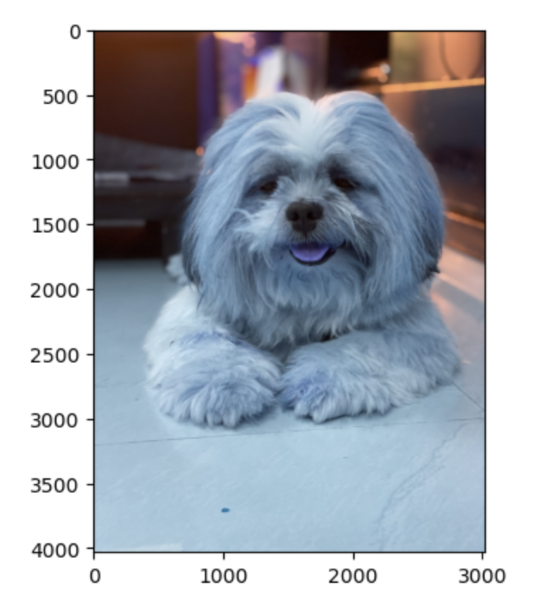

# DS4400: Final Project 
*By Srishti Kundu and Caitlin Chao*
---
Topic: Dog Breed Classification System 

Questions:
- How do we identify different breeds of dogs? 
- How does our model handle non-dog inputs? 
- When entering a person's picture, determine what dog breed they look like!

Data: [Stanford Dogs Dataset](https://www.kaggle.com/datasets/jessicali9530/stanford-dogs-dataset)
- Number of categories (breeds): 120
- Number of images: 20,580

---
## Requirements 
*Requirements can be downloaded using "pip" on terminal*
- tensorflow 
- tensorflow_hub
- keras
- keras-applications
- tqdm
---
## Data Preparation 
Download the following (or use the Data folder)
- Main Dogs Dataset: [Stanford Dogs Dataset](https://www.kaggle.com/datasets/jessicali9530/stanford-dogs-dataset)
  - We will only use the Dogs/images/Images folder 
- Human Faces Dataset: [Web-scraped Human Faces](https://www.kaggle.com/datasets/ashwingupta3012/human-faces)
---
## Models 
1. CNN Pt. 1
  - 3 convulational layers
  - max-pooling layer with a pool size of 2x2
  - dropout layer with a dropout rate of 0.25
  - fully connected layer (512 neurons and a ReLU activation function) 
  - 10 epochs

2. CNN Pt. 2 
  - changes from pt 1 include... 
    - 4 convulational layers (vs. 3) 
    - Batch normalization layers to improve performance 
    - 20 epochs

TRANSFER LEARNING: using pre-trained deep learning model that was trained on a large-scale image classification task

3. XCeption (pre-trained on the ImageNet dataset) 
  - Sequential model 
  - Dense layer with 120 neurons and softmax activation function 

4. ResNet50 (deep convolutional neural network architecture)
  -  Dense output layer with 120 neurons and softmax activation function 

---
## Testing! 

